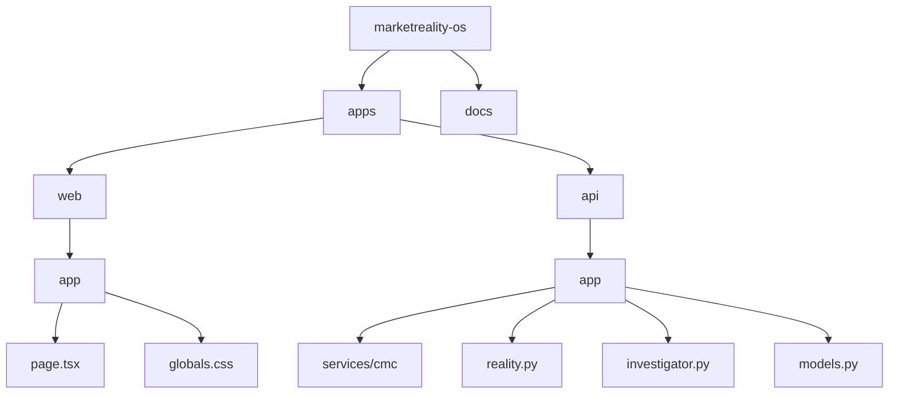

# MarketReality OS

[](https://nextjs.org/)
[](https://fastapi.tiangolo.com/)
[](https://coinmarketcap.com/api/)
[](https://opensource.org/licenses/MIT)

> **Market integrity and tradability intelligence engine built on CoinMarketCap market data.**

MarketReality OS separates market observations from derived findings and preserves the evidence chain between them. CMC provides the market evidence; MarketReality OS turns that evidence into an auditable structural investigation.

## Build with CMC: CoinMarketCap API Hackathon

MarketReality OS was built for the Build with CMC: CoinMarketCap API Hackathon to explore how CoinMarketCap market data can be transformed into an auditable market-structure investigation system.

CMC API ↓ Market Data ↓ Structural Analysis ↓ Evidence ↓ Investigation

## Engineering Principles

- **Evidence before interpretation**: Findings should be traceable to underlying observations.
- **Deterministic analysis**: Numerical calculations should be reproducible.
- **No fabricated market data**: Unavailable data remains unavailable.
- **Explicit uncertainty**: The system distinguishes between live, cached, unavailable, and insufficient evidence where supported.
- **Separation of concerns**: CMC provides data. MarketReality analyzes the data. The frontend presents the result.

## What MarketReality OS Is Not

- not financial advice
- not a trading signal generator
- not an execution engine
- not a guaranteed slippage estimator
- not a prediction engine
- not a replacement for exchange execution infrastructure

## Limitations

- CMC endpoint availability depends on plan (e.g. historical data or deep order books).
- some fields may be null.
- available market data may not represent every market worldwide.
- structural tradability is not execution certainty.
- stress tests are hypothetical structural simulations.
- cached data is not live data.

## Technology Stack

| Layer | Technology |
|---|---|
| Frontend | Next.js, React, TypeScript |
| Backend | FastAPI, Python |
| Language | TypeScript, Python |
| Market Data | CoinMarketCap API |
| Analysis | Deterministic MarketReality Engine |
| Database | None (Stateless analysis pipeline) |
| Testing | None implemented |
| Deployment | Node.js (Frontend), Uvicorn/FastAPI (Backend) |

## System Architecture



## Documentation

- [Architecture](docs/architecture.md)
- [Data Flow](docs/data-flow.md)
- [Reality Gap](docs/reality-gap.md)
- [Trade Reality](docs/trade-reality.md)
- [Stress Lab](docs/stress-lab.md)
- [Evidence Model](docs/evidence-model.md)
- [CMC Integration](docs/cmc-integration.md)
- [Demo](docs/demo.md)

## Quick Start

### Requirements
- Node.js (v18+)
- Python (3.10+)
- uv (Python package manager)

### Installation

1. **Clone the repository**
2. **Setup Frontend:**
   ```bash
   cd apps/web
   npm install
   ```
3. **Setup Backend:**
   ```bash
   cd apps/api
   uv venv
   # On Windows: .\.venv\Scripts\activate
   # On Unix: source .venv/bin/activate
   uv pip install -r requirements.txt
   ```

### Environment

Create a `.env` file in `apps/api`:
```bash
cp apps/api/.env.example apps/api/.env
```
Add your CMC Pro API key to `apps/api/.env`:
```
CMC_PRO_API_KEY=your_actual_key_here
```

### Run

**Terminal 1 (Backend):**
```bash
cd apps/api
# Ensure virtual environment is active
uvicorn app.main:app --host 0.0.0.0 --port 8000 --reload
```

**Terminal 2 (Frontend):**
```bash
cd apps/web
npm run dev
```

Visit `http://localhost:3000` in your browser.

## License

MarketReality OS is released under the MIT License.
See [LICENSE](./LICENSE).
