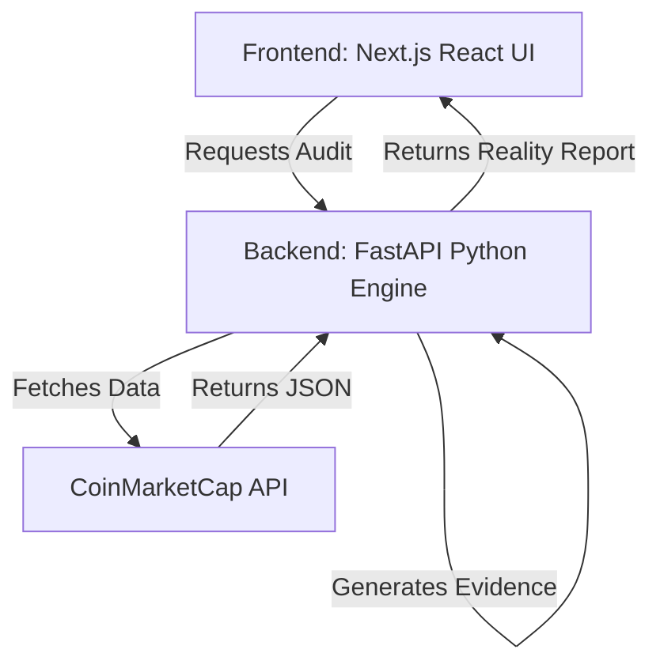

# Architecture

MarketReality OS is a Next.js (Frontend) and FastAPI (Backend) application built on top of the CoinMarketCap (CMC) API.

## Core Separation of Concerns

1. **CoinMarketCap** provides the raw market data.
2. **MarketReality OS (Backend)** normalizes the data, applies deterministic structural calculations, and generates Evidence objects.
3. **MarketReality OS (Frontend)** presents the auditable results to the user.

## Component Diagram

## How It Works

- The user enters a symbol (e.g., "BTC") in the UI.
- The UI calls the FastAPI backend.
- The backend fetches the `/v2/cryptocurrency/quotes/latest` and `/v2/cryptocurrency/market-pairs/latest` endpoints from CMC.
- The **Reality Engine** (`reality.py`) calculates structural metrics (Volume Concentration, Venue Dependence, Price Agreement).
- For every calculation, an **Evidence** object is created linking the finding to the exact CMC endpoint and timestamp.
- The result is compiled into a `RealityReport` and sent to the frontend.

## Relevant Source Files
- `apps/api/app/main.py` - API entrypoints
- `apps/api/app/reality.py` - Deterministic Reality Engine
- `apps/api/app/investigator.py` - Evidence Investigator
- `apps/api/app/models.py` - Data models (RealityReport, Evidence, MarketPair)
