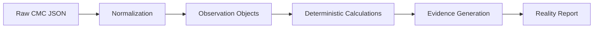

# Data Flow

The data flow in MarketReality OS is strictly one-way and immutable after observation.

## Flow Diagram

## How It Works

1. **Normalization**: Raw CMC API responses (which have varying shapes depending on the endpoint) are mapped into standard `MarketPair` and `Venue` Pydantic models. CEX and DEX markets are identified via the CMC `category` field.
2. **Observation**: Raw data is immediately tagged with the `observation_timestamp`.
3. **Calculation**: The deterministic engine calculates metrics like Top-5 Concentration.
4. **Evidence Generation**: Every calculation yields an `Evidence` object containing the `evidence_id`, `calculation` used, and `source_endpoint`.

## Data States

- **LIVE**: Data fetched directly from the CMC API.
- **CACHED**: If the CMC API rate limits or the user is on the Free Plan (which restricts historical/depth endpoints), the system may fall back to cached snapshots.
- **UNAVAILABLE**: Endpoint inaccessible.
- **INSUFFICIENT EVIDENCE**: The API returned data, but the sample size was too small to make a structural claim (e.g., only 1 market pair observed).

## Relevant Source Files
- `apps/api/app/models.py` (Pydantic schemas)
- `apps/api/app/services/cmc/market_pairs.py` (CMC integration)
